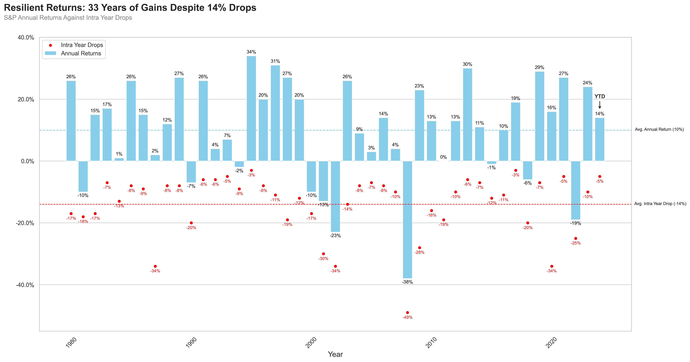

# Assignment Submissions
Attached please find my recreations of the graphs I was presented with along with their headlines and possible social media posts. 

[Follow this link](https://x.com/mockdatasa) to see an example of the social media posts on X 
## Assignment 1

### Headline: 
Resilient Returns: 33 Years of Gains Despite 14% Drops

### Social Media Post:
Despite average intra-year drops of -14%, the S&P 500 has achieved positive annual returns in 33 of the past 44 years. Discover how the market's resilience turns short-term setbacks into long-term successes! $SPX #trading #markets #finance

## Assignment 2 (Option 1)

### Headline:
Outpacing Top Market Giants

### Social Media Post:
Mock company's strategy outpacing the S&P 500 and top market giants. Curious to see how the competition stacked up? Check out the full breakdown below! #investingtips  #trading #SP500 #fintech

## Assignment 2 (Option 2)

### Headline:
A Race to the Top!

### Social Media Post:
Uncover the dynamics of S&P 500 trading. 📊 We highlight how your trading approach—from the top 7 traders to a streamlined S&P 493— could shape overall returns. See how our approach compares below! $SPX #fintech #TradingTips

## Assignment 2 (Option 3)

### Headline:
Strategy Showdown: Alpha Picks vs. S&P 500's Magnificent 7 and the Broader Market

### Social Media Post:
📊 Strategy Showdown! 🚀 Dive into our latest analysis comparing Alpha Picks against the S&P 500's top 7 giants and more. See how our picks stack up and subscribe to find out what’s driving their performance! #fintech #investingtips $SPY #TradingTips

## Assignment 2 (Option 4)

### Headline:
AUM: Growth in Action, Alpha Picks Lead the Pack

### Social Media Post:
AUM Growth in Action! 📈 See how five strategies, each starting with $10M, navigate their paths to maximize growth. Who do you think will lead the way? 🚀 #fintech #tradingtips #sp500 #investingstrategies
